# Goal Management System — Full Specification
> **Source:** FN Group People & Performance — Brainstorming Session 1 (PTR Lead · Internal Use Only)
> **Scope:** Goal Management only — Stages 1 through 6 (Cycle Open → Quarterly Check-In)
> **Status:** Decisions captured from live session. Items marked ⚠️ OPEN are unresolved and require an owner + due date before build begins.
> **Purpose:** Single source of truth for the Goal Management module. Every decision, rule, permission, flow step, and edge case is written here with zero ambiguity. Nothing requires inference.
>
> **Flowcharts (plain language):** Open [`Goal_Management_Flowcharts.html`](./Goal_Management_Flowcharts.html) in a browser — landscape left → right.

---

## Table of Contents
0. [Visual Overview](#0-visual-overview)
1. [Roles & Permissions Matrix](#1-roles--permissions-matrix)
2. [Goal Lifecycle — 6 Stages](#2-goal-lifecycle--6-stages)
   - [Stage 1: Cycle Opens & OKR Setup](#stage-1-cycle-opens--okr-setup)
   - [Stage 2: Employee Goal Creation](#stage-2-employee-goal-creation)
   - [Stage 3: Manager Batch Approval](#stage-3-manager-batch-approval)
   - [Stage 4: Day 30 Lock](#stage-4-day-30-lock)
   - [Stage 5: Progress Updates (Mid-Quarter)](#stage-5-progress-updates-mid-quarter)
   - [Stage 6: Quarterly Check-In (Q1, Q2, Q3 Only)](#stage-6-quarterly-check-in-q1-q2-q3-only)
3. [Goal Field Definitions](#3-goal-field-definitions)
4. [Weightage Rules](#4-weightage-rules)
5. [Notification & Reminder Rules](#5-notification--reminder-rules)
6. [Edge Cases](#6-edge-cases)
7. [Data Migration (Goal Data Only)](#7-data-migration-goal-data-only)
8. [Version Roadmap (V1 vs V2)](#8-version-roadmap-v1-vs-v2)
9. [Open Items Register](#9-open-items-register)

---

## 0. Visual Overview

Use this section as a map of the whole module. Rules and edge cases live in the numbered sections below.

### End-to-End Lifecycle (One Quarter)

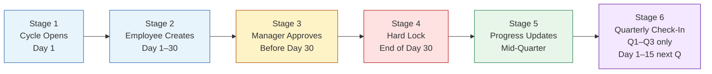

### Who Acts When

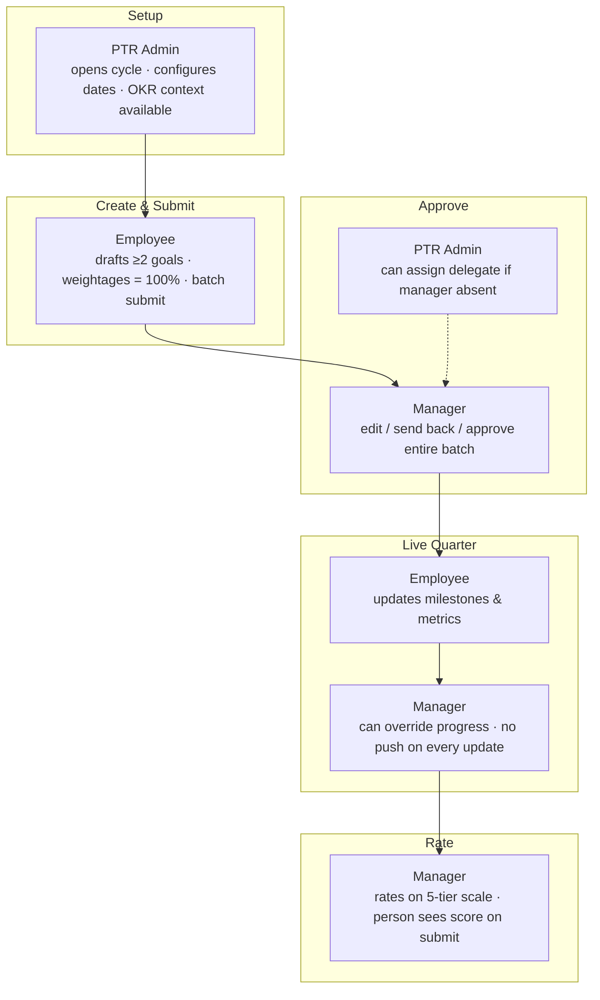

### Concurrent Windows (Same Calendar Period)

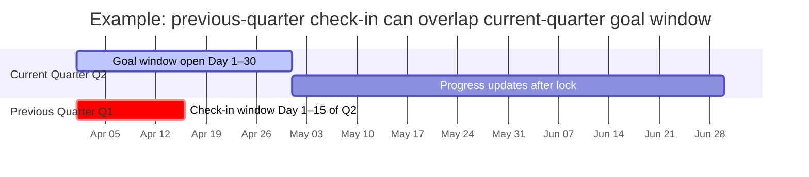

### System Boundaries (OKR vs Performance)

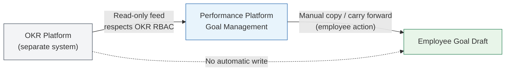

---

## 1. Roles & Permissions Matrix

There are **7 roles** in the system. The table below defines exactly what each role can do with goals.

| Role | Create Goal | Edit Goal | Submit Goal | Approve Goal | View Goals |
|---|---|---|---|---|---|
| **Employee** | ✅ Own goals only | ✅ Own goals only | ✅ Own goals only | ❌ No | ❌ Cannot view others |
| **Manager** | ✅ Yes | ✅ Team's goals during approval | ✅ Yes | ✅ Team's goals | ❌ No separate view-only access |
| **Senior Manager** | ❌ No | ❌ No | ❌ No | ❌ No | ✅ View only |
| **HOD** | ❌ No | ❌ No | ❌ No | ✅ Yes | ✅ Yes |
| **HRBP** (own dept only) | ❌ No | ❌ No | ❌ No | ❌ No | ✅ Own department only |
| **HRBP Lead** (all depts) | ✅ Yes | ✅ Yes | ✅ Yes | ❌ No | ✅ All departments |
| **PTR / Admin** | ✅ Yes | ✅ Yes | ✅ Yes | ✅ Yes | ✅ Yes |

### Permission Snapshot (Quick Scan)

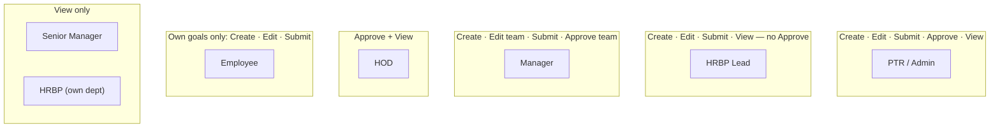

> **Universal exception:** No role — including PTR/Admin — may edit their own goals mid-quarter without the multi-party post-lock process.

### Role-Specific Clarifications

**Employee**
- Can create, edit, and submit their own goals only.
- Cannot approve any goal, including their own.
- Cannot view any other employee's goals.
- Cannot edit their own goals mid-quarter after the Day 30 lock without a special multi-party approval process (see [Stage 4](#stage-4-day-30-lock)).

**Manager**
- During the approval stage, the manager can edit: goal description, goal type, goal priority, goal weightage, measurement weightage; and can add or remove measurements.
- Approves goals in batch per employee — approval is all-or-nothing per employee, not per individual goal.
- A manager's own goals go through the same creation and submission process as any employee's goals, approved by their own immediate manager.
- HOD's goals are approved by SLT (Senior Leadership Team).

**Senior Manager**
- View only. No create, edit, submit, or approve rights whatsoever.

**HOD**
- Can approve goals within their department.
- Has view access across the department.
- Their own goals are approved by SLT.

**HRBP**
- Can only see goals within their assigned department(s). Cannot see goals outside their assigned department.
- No edit or approval rights at all.
- Must have access to visualization tools and dashboards to perform their role.

**HRBP Lead**
- Can see all departments.
- Has create, edit, and submit rights but no approval rights.

**PTR / Admin**
- Has all access at all times, with one specific exception:
  - **Cannot edit their own goals mid-quarter** — this restriction applies equally to all roles.
- For any past-quarter changes by any user: requires approval from all three of the following — (a) the employee's manager, AND (b) the manager's manager (+1), AND (c) HRBP. All three must approve.

---

## 2. Goal Lifecycle — 6 Stages

The goal management process follows a strict sequence of stages within each performance quarter.

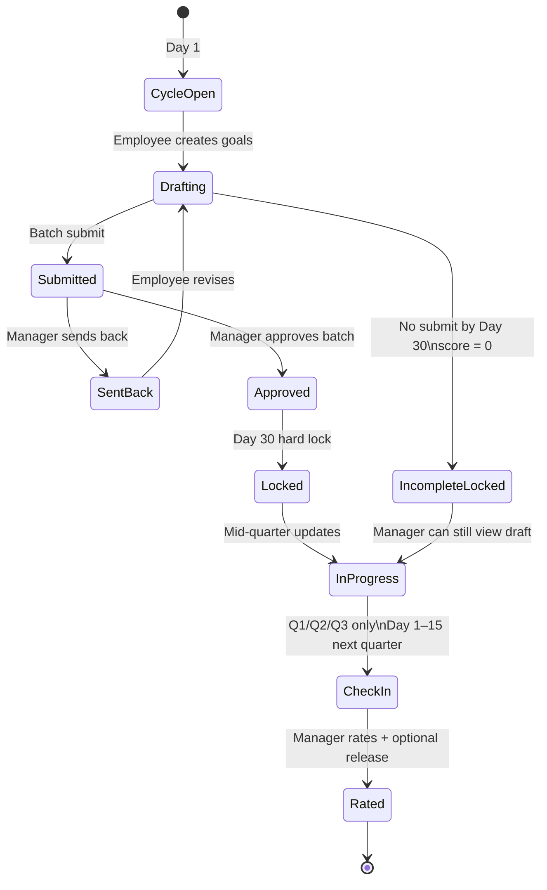

---

### Stage 1: Cycle Opens & OKR Setup

**When:** Day 1 of the performance quarter.

#### Goal Window
- The goal submission window **opens on Day 1** and **locks on Day 30**.
- The lock date is **not hardcoded** — PTR Admin must be able to change these dates through a configurable interface.
- The current quarter's goal-setting window and the previous quarter's check-in window can be **open and running simultaneously**.

#### Who Is Eligible for This Quarter’s Goals
- Eligible **only if** the employee’s **join date is on or before Day 1** of the quarter.
- Join after Day 1 → **not eligible** this quarter (starts from the next qualifying quarter).
- **Probation does not change eligibility** — same join-date rule applies.

#### Multiple Concurrent Cycles
- The system must support **multiple performance cycles running at the same time** (e.g., different cycles for different departments, teams, or employee groups).
- Within a single cycle, PTR Admin must be able to **extend the deadline for a specific team, department, or group of people** without affecting the rest of the organization. This must be done through a simple interface.
- The **frequency of cycles must be configurable** — not fixed to quarterly only.

#### OKR Integration
- The OKR platform and the Performance platform are **two completely separate systems**. They are not merged into one.
- Company-level and department-level OKRs are fed into the Performance platform as **read-only context** — employees can see OKRs while writing goals but cannot edit them from inside the Performance platform.
- The read-only OKR data inside the Performance platform must respect the **RBAC permissions set in the OKR platform**. If a user cannot see a particular OKR in the OKR platform, they also cannot see it in the Performance platform.
- Employees can **manually copy** an OKR into a goal field (carry it forward). This is a manual action by the employee — the OKR platform does not automatically write into the Performance platform.
- The RACI from Key Results (KRs) in the OKR platform must be **viewable from within the Performance platform**.
- **V1:** OKR appears as a read-only reference panel alongside the goal creation form.
- **V2:** A button lets the employee click an OKR and auto-populate a goal draft from it.

#### Notifications at Stage 1
- Automated reminders are sent at **Day 7, Day 14, and Day 25** of the goal window.
- PTR Admin configures the cadence, content, and timing of these reminders.
- Reminders are sent via: **Email**, **Platform notification**, and **ClickUp**.
- The system must support reminders triggered by both **specific date** and **specific time of day** — not date only.

#### Stage 1 Flow

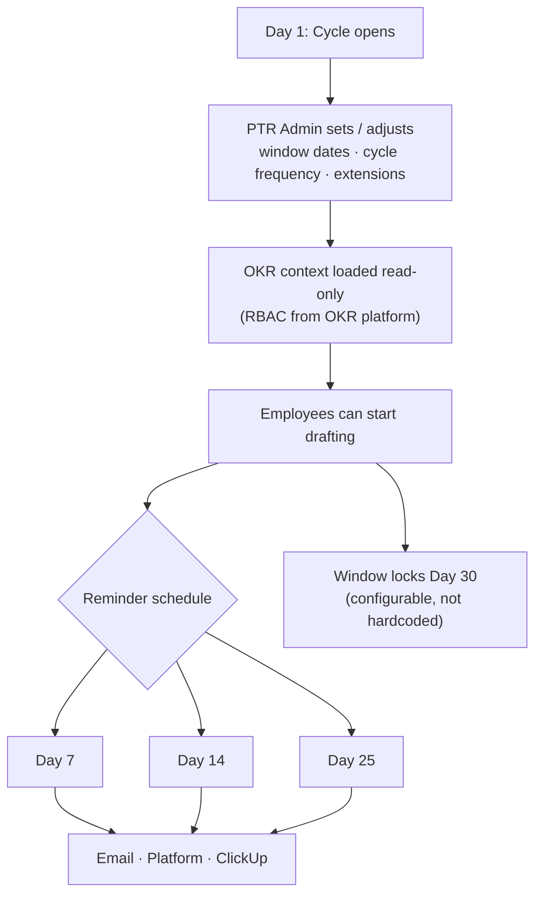

---

### Stage 2: Employee Goal Creation

**Who acts:** Employee
**When:** Day 1 – Day 30 of the quarter

#### OKR Context Panel
- When creating goals, the employee sees company-level and department-level OKRs in a **read-only reference panel** on the same screen.
- Tagging a goal to an OKR is **not mandatory** in V1.

#### Goal Count Rules
- **Minimum allowed:** 2 goals. The system prevents submission of fewer than 2.
- **Company requirement:** 3 goals.
- **No hard maximum**, but the system enforces two warnings:
  - If the employee tries to submit **fewer than 3 goals**: system shows a warning — *"Your company requires a minimum of 3 goals. Are you sure you want to submit?"* — the employee can still proceed past the warning.
  - If the employee tries to submit **more than 5 goals**: system shows a warning — *"You are submitting more than 5 goals. Are you sure?"* — the employee can still proceed past the warning.

#### Auto-Save
- All goals are **auto-saved as drafts continuously** while the employee is writing.
- Clicking outside a text field does **not** cancel or lose the content. Drafts are preserved.
- The employee can close the platform and return in a later session without losing any progress.

#### Copy from Last Quarter
- Employees can copy their goals from the previous quarter as a quick-start action.
- Copied goals appear as **pre-filled draft forms** — not as submitted goals. The employee must review and edit before submitting.

#### Goal Cascade (Manager → Employee)
- A manager can cascade one of their own goals down to a direct report, and cascades can go multiple levels deep (e.g., Jayed → Fahim → Aminul through the reporting chain).
- When a manager cascades a goal to an employee (example: Angie cascades to Fahim):
  - The cascaded goal **appears on Fahim's dashboard** for him to see.
  - The **"Linked Goals" field** in Fahim's goal form is **auto-filled** with Angie's goal name.
- Linking a goal to a manager's cascaded goal is **optional** for the employee — not forced.

#### Goal Fields (Per Goal)
Every goal contains the following fields. All fields are carried over from Revolut and mapped into the new platform:

| Field | Description | Mandatory |
|---|---|---|
| Goal Description | Free text description of what the goal is | ✅ Yes |
| Goal Type | `Outcome` or `Output` — select one | ✅ Yes |
| Process Type | `OKR`, `BAU` (Business As Usual), or `PI` (Performance Improvement) — select one | ✅ Yes |
| Priority | `High`, `Medium`, or `Low` — select one | ✅ Yes |
| Goal Weightage | % weight of this goal relative to all goals — must sum to 100% across all goals | ✅ Yes |
| Linked Goals (Cascade) | Reference to a manager's cascaded goal | ❌ Optional |
| Measurements | At least 1 measurement per goal (milestones and/or metrics — see below) | ✅ Min 1 required |

#### Measurements (Per Goal)
Each goal must have **at least 1 measurement**. A single goal can have multiple measurements. Two types exist and can be mixed freely within the same goal:

**Type 1 — Milestones (Binary)**
- A checklist of tasks or events.
- Each milestone is either **complete (✅) or incomplete (❌)**. There is no partial state.
- Multiple milestones allowed per goal.

**Type 2 — Metrics (Numeric)**
- Each metric has: a **start value**, a **target value**, and a **current value** (updated by the employee during the quarter).
- Supported comparison directions (carried over from Revolut — only the working ones are kept):
  - **Greater than target** — for increasing numbers (e.g., revenue must go up)
  - **Less than target** — for decreasing numbers (e.g., support tickets must go down)
  - **Within a range** — value must stay between a defined minimum and maximum
  - *(Comparison types from Revolut that did not work in practice are removed)*
- Multiple metrics allowed per goal.
- A single goal can have **both milestones and metrics at the same time** — mixing is fully allowed.

**Metric Units**
- Units are selected from a **predefined list** — not free text. Current options: `%`, `number`, `days`, `currency`.
- Only **PTR/Admin can add new unit types** to the predefined list.

**Measurement Weightage**
- Each measurement within a goal has its own **weight (%)**.
- All measurement weightages within a single goal must sum to **exactly 100%**.
- The platform displays the **overall % impact** each measurement has on the goal score.

**Proof & Comments per Measurement**
- Each measurement supports: a **proof link** (URL) and a **free text comment**.
- These are optional and allow the employee to attach evidence of progress.

**Custom Formulas**
- Custom measurement formulas are a **V2 feature only**. Not built in V1.
- No third-party integrations for measurements are being built.

#### Batch Submission
- The employee drafts all their goals first, then submits **all goals in a single action**.
- The **Submit button is locked** until every goal has at least 1 measurement attached.
- Once submitted, all goals go to the manager as a single batch for approval.

#### Stage 2 Flow — Create → Validate → Submit

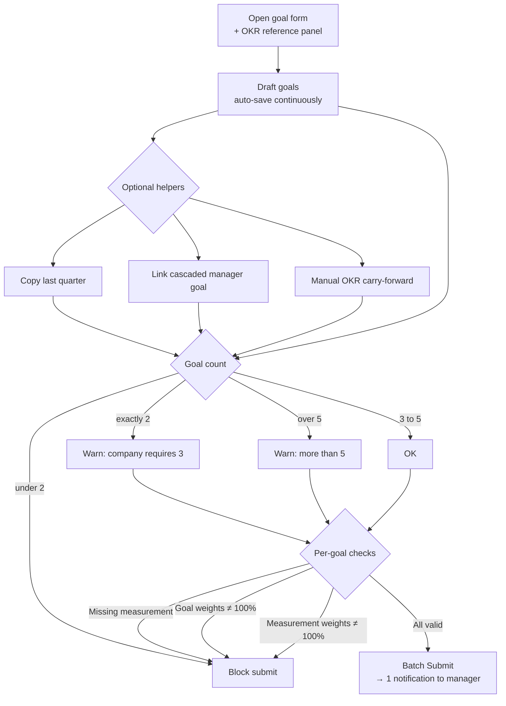

#### Goal Object Structure

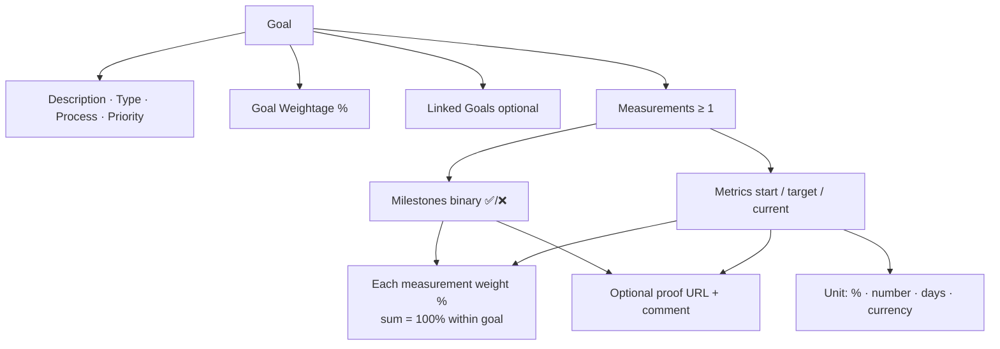

#### Cascade Chain Example

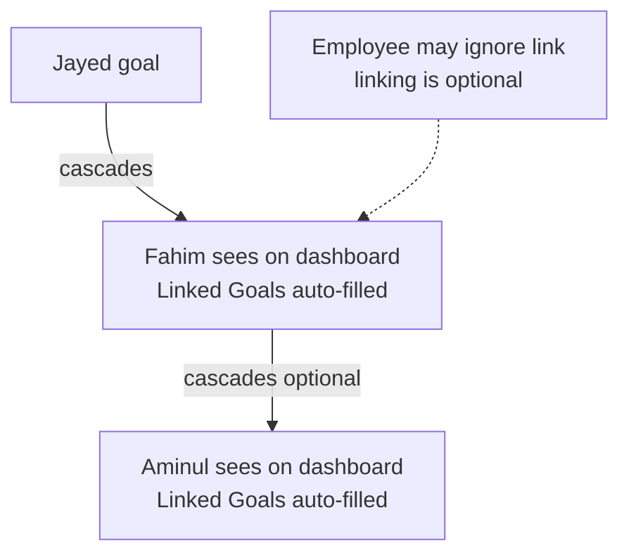

---

### Stage 3: Manager Batch Approval

**Who acts:** Manager (and after Day 30 hard lock: also +1 via HRBP delegation — see Stage 4)
**When:** After employee submits. Ideally before Day 30; **pending approvals may continue after Day 30 hard lock**.

#### Approval Screen
- The manager sees a **queue of all direct reports** who have submitted goals.
- The manager reviews **one employee at a time**, using a "Next" button to move through the queue.

#### Example of the Full Approval Flow
1. Fahim (employee) creates and submits all goals → sent to Angie (manager) as a single batch.
2. Angie opens Fahim's submission and reviews all goals together.
3. If Angie finds an issue, she contacts Fahim **offline** (outside the platform).
4. Fahim makes changes based on the offline discussion, resubmits.
5. Angie approves **all of Fahim's goals together in one action**.
6. Angie **cannot approve individual goals** within Fahim's submission — approval is per-employee batch only. *(The team noted flexibility to revisit this rule if needed.)*

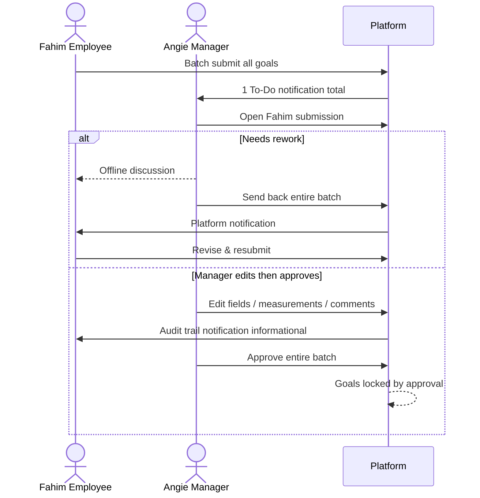

#### What the Manager Can Do During Approval
The manager can perform all of the following on an employee's submitted goals:

- ✅ Approve all goals (entire batch in one action)
- ✅ Edit goal description
- ✅ Edit goal type (`Outcome` / `Output`)
- ✅ Edit goal priority (`High` / `Medium` / `Low`)
- ✅ Adjust goal weightage (%)
- ✅ Adjust measurement weightage (%)
- ✅ Add new measurements to any goal
- ✅ Remove existing measurements from any goal
- ✅ Add comments to any goal
- ✅ Send back the **entire submission** to the employee (cannot send back individual goals — only the whole batch)

#### Employee Notification of Manager Edits
- If the manager edits **anything**, the employee is **automatically notified**.
- The notification includes an audit trail: who changed what, from what value, to what value.
- The employee does **not** need to acknowledge or re-approve the edits. Notification is informational only.
- Manager approval auto-locks the goals — no employee re-confirmation is required.

#### Send Back Rules
- The manager can only send back the **entire submission** — not individual goals.
- Sending back is used when major errors or significant rework is needed.

#### Manager Delegation (When Absent)
- If a manager is absent, **PTR Admin assigns a delegate** to perform the approval.
- The delegate has the **same approval rights** as the original manager.
- The **manager record does not change** — only the responsibility is temporarily delegated.
- All delegation actions are **logged in the audit trail**.

#### Manager Reminder Cadence

**Manual Mode (available immediately):**
- PTR can manually trigger a mass notification reminding employees to submit or update goals.
- When triggering the mass reminder, PTR can:
  - Select a **message template**.
  - See how many people have submitted vs. not submitted.
  - Send only to those who **have not yet submitted** (not to everyone).
- Channel: **Email** first, **ClickUp** added later.

**Automated Mode (when system is ready):**
- PTR will configure the rules for when automated reminders fire.
- Timing and conditions to be decided when building the automated system.

#### Stage 3 Decision Tree

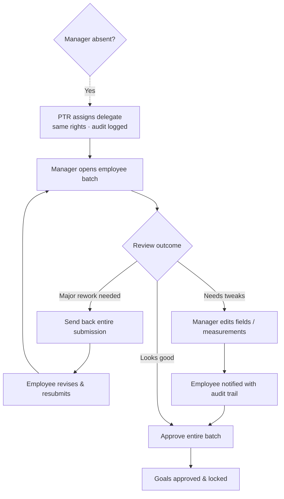

---

### Stage 4: Day 30 Lock

**When:** End of Day 30

#### Hard Lock
- Day 30 is a **hard lock** on **new goal submission**. After Day 30, no employee can submit new goals — without PTR Admin override.
- **Submitted but not yet approved** batches are **not rejected**. Approval remains open after Day 30 so work is not left hanging.

#### Pending Approval After Hard Lock (Submitted, Not Yet Approved)
When an employee submitted before Day 30 but the manager has not approved by hard lock:

- The submission stays in **"Submitted — pending approval"** status.
- The **direct line manager can still approve** after Day 30.
- **HRBP must delegate** goal-approval rights to the **manager's manager (+1)** so the +1 can also approve.
- Either the direct manager **or** the +1 (via HRBP delegation) may complete the approval after hard lock.
- Employees still **cannot** create or submit new goals after Day 30.

#### Graduated Post-Lock Change Approval
After Day 30, any **change to an already-approved / locked goal** requires multi-party approval. The level of approval depends on how far past the lock date the change is being made:

| Timing of Change Request | Approval Required |
|---|---|
| Day 30 – Day 31 (grace period) | Manager approval only |
| After Day 31 | Manager + Manager's Manager (+1) must both approve. HRBP is also notified. |

- These post-lock **change** rules are a **configurable setting inside the cycle setup** — not hardcoded into the system.
- These change rules are separate from **pending first-time approval** after hard lock (see above).

#### No Submission by Day 30
If an employee did not submit goals by Day 30, the following happens automatically:

- Their goals are **auto-locked** in whatever state they were in (draft or empty).
- Their submission is **flagged as incomplete** in the system.
- Their score for that quarter is automatically **zero (0)**.
- The zero score **feeds into their annual average**.
- The manager can still **see the incomplete draft** (if any draft exists).

#### Stage 4 Lock & Post-Lock Paths

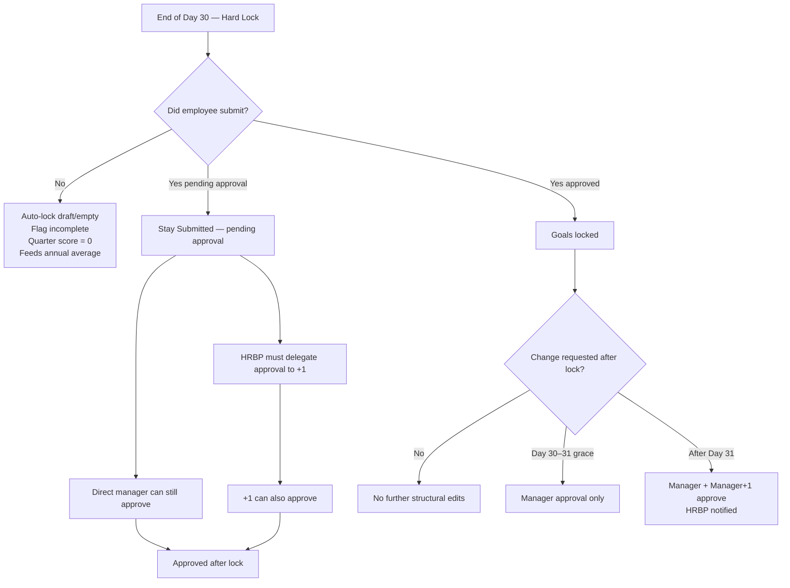

---

### Stage 5: Progress Updates (Mid-Quarter)

**Who acts:** Employee (primary), Manager (can adjust)
**When:** Any time after the Day 30 lock, throughout the quarter

#### Employee Progress Updates
- Employees can update their progress **in real time** at any point during the quarter.
- They can also follow a structured cadence: weekly, monthly, or at quarter-end — the choice is theirs.
- **Milestone updates:** Employee ticks a milestone as complete (binary toggle).
- **Metric updates:** Employee enters the new current value of the metric.

#### Manager Visibility of Progress
- The manager can see all progress updates in real time by navigating to an employee's profile.
- The manager does **not** receive a notification every time an employee logs a progress update. Updates are visible on demand — not pushed to the manager automatically.

#### Manager Adjustment of Employee Progress
- The manager can **override an employee's progress update** if they disagree with it.
- Example: if an employee marks a milestone as complete but the manager disagrees, the manager can reverse the milestone back to incomplete.

#### Metric Target Changes Mid-Quarter
- If a strategy shift causes a metric target to become irrelevant or incorrect, the target can be changed mid-quarter.
- ⚠️ **OPEN:** Who has authority to change a metric target mid-quarter — employee only, manager only, or either? Does it require approval? What happens to progress already recorded against the original target if the goal is discarded entirely?

#### Blocked Goals
- Employees can mark a goal as "Blocked."
- **No automatic notification** is sent to the manager when a goal is marked blocked.
- *(Decision rationale: The team prefers employees to communicate blockers directly via chat — an automated system notification was considered unnecessary overhead.)*

#### End-of-Quarter Reminders
- In the **last 15 days of the quarter**, the system automatically sends reminders to employees to update their goal status and record their final result.
- These reminders connect into the existing reminder cadence system.

#### Late Updates (First Week of New Quarter)
- Employees are permitted to log progress updates in the **first 1 week of the new quarter** for the previous quarter's goals.
- This applies specifically to: **CPM, BI, and MKT** departments. It is required for those teams.

#### Progress History
- ⚠️ **OPEN:** Should the platform show the full timeline of every update ever made to a goal, or only the latest value?
- **V2 option:** The platform will publish an API so employees and managers can connect their own external dashboards. Goals will update automatically via the API feed.

#### Stage 5 Progress Loop

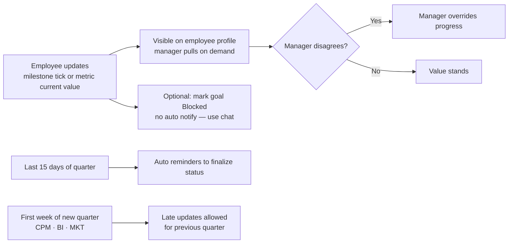

---

### Stage 6: Quarterly Check-In (Q1, Q2, Q3 Only)

**Who acts:** Manager
**When:** Q1, Q2, and Q3 only.
> ⚠️ Q4 does NOT have a standalone check-in. Q4 is handled inside the annual appraisal process, which is out of scope for this document.

#### Check-In Window
- Opens on **Day 1 of the following quarter**.
- Closes on **Day 15 of the following quarter**.
- PTR Admin can customize these dates if operationally needed.

#### Check-In Format
- Follows the existing **Revolut check-in format**. The team is familiar with this structure and it is retained as-is.

#### What the Manager Sees During Check-In
- For each of the employee's goals: the **goal completion percentage** — calculated by the system based on milestone completions and metric values vs. targets.
- An overall **weighted completion percentage** — calculated by the system using goal weightages and measurement weightages combined.
- The system **displays the percentage only**. The system does **not** recommend or suggest a rating. The manager makes the rating decision independently based on the data shown.

#### How the Manager Rates
- The manager rates the employee's performance for that quarter on a **5-tier scale**.
- Each quarter is rated **independently** — Q1 rating does not affect Q2 rating in any way.
- There is a **free text comment box** for the manager to add narrative context per check-in.

#### Employee Self-Rating at Check-In
- Employees do **not** self-rate at the quarterly check-in.
- Employee self-rating happens **only at the annual appraisal** (year-end). This is out of scope for this document.
- ⚠️ **OPEN:** Should self-rating be introduced at H1 and H2 (semi-annual) instead of or in addition to year-end? To be decided.

#### Rating Visibility to Employee
- When the manager **gives the score and submits**, the person **sees the score immediately**.
- No separate release step.

#### Stage Independence
- Each check-in runs **independently per population**.
- A delay by a senior leader completing their own check-in does **not block** the rest of the organization from completing theirs.

#### Quarter Weightage Toward Annual Score
- All four quarters contribute **equally** to the annual score: Q1 = 25%, Q2 = 25%, Q3 = 25%, Q4 = 25%.
- This is a fixed, equal-weight model. It is not configurable per the current decision.

#### Stage 6 Check-In Flow

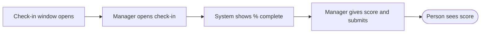

#### Annual Score Contribution

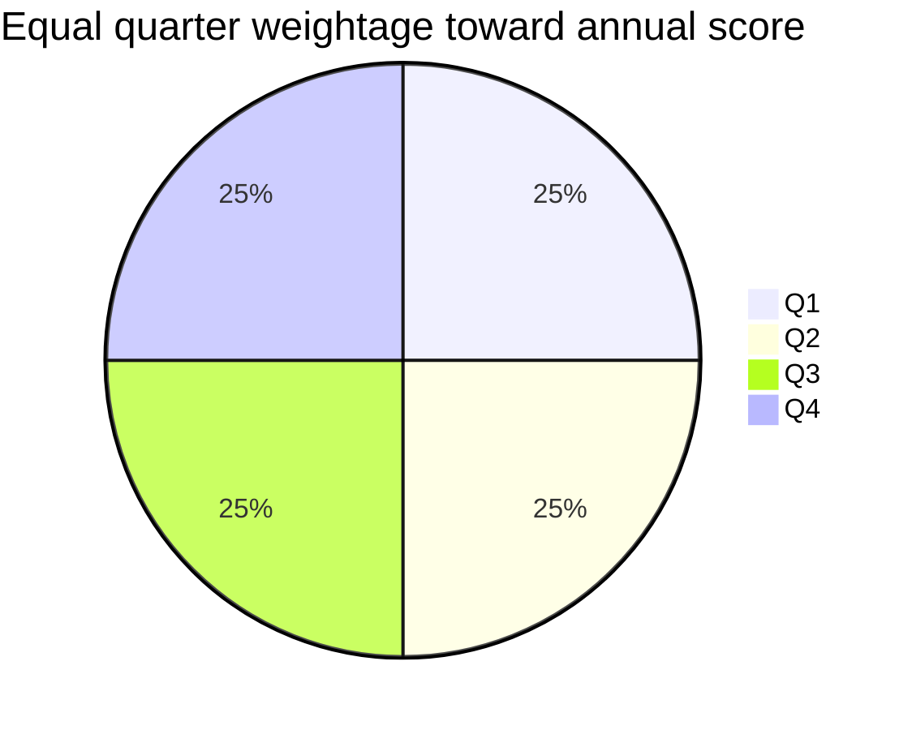

---

## 3. Goal Field Definitions

| Field | Allowed Values | Mandatory | Who Can Edit After Employee Submits |
|---|---|---|---|
| Goal Description | Free text | ✅ Yes | Manager (during approval) · PTR Admin (always) |
| Goal Type | `Outcome` or `Output` | ✅ Yes | Manager (during approval) · PTR Admin (always) |
| Process Type | `OKR`, `BAU`, `PI` | ✅ Yes | Manager (during approval) · PTR Admin (always) |
| Priority | `High`, `Medium`, `Low` | ✅ Yes | Manager (during approval) · PTR Admin (always) |
| Goal Weightage | % — must sum to 100% across all goals | ✅ Yes | Manager (during approval) · PTR Admin (always) |
| Linked Goal (Cascade) | Reference to manager's goal | ❌ Optional | Manager (during approval) · PTR Admin (always) |
| Measurements | Min 1 per goal (milestones and/or metrics) | ✅ Min 1 | Manager (add/remove during approval) · Employee (update values mid-quarter) · PTR Admin (always) |
| Measurement Weightage | % — must sum to 100% within each goal | ✅ Yes | Manager (during approval) · PTR Admin (always) |
| Metric Unit | Predefined list: `%`, `number`, `days`, `currency` | ✅ Yes (metrics only) | PTR Admin only (to add new unit types to the list) |
| Proof Link | Valid URL | ❌ Optional | Employee (mid-quarter) · PTR Admin (always) |
| Comments | Free text | ❌ Optional | Employee (mid-quarter) · Manager (approval & check-in) · PTR Admin (always) |

---

## 4. Weightage Rules

Three separate weightage rules exist. They operate at different levels and must not be confused with one another.

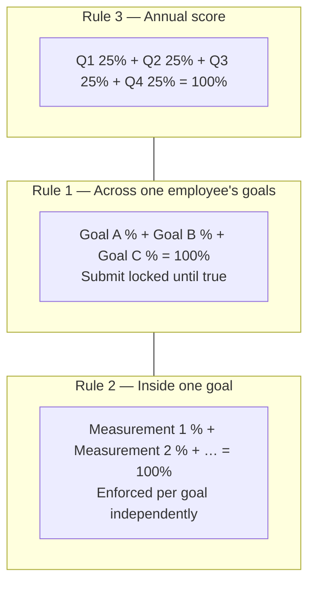

#### Scoring Composition (Conceptual)

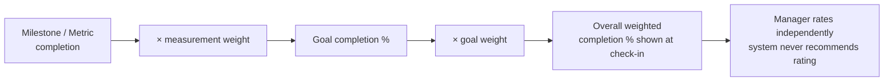

### Rule 1 — Goal Weightage (across all goals of one employee)
- Each goal has a weightage percentage set by the employee.
- The **sum of all goal weightages must equal exactly 100%** before the employee can submit.
- The Submit button is **locked** until this condition is satisfied.

### Rule 2 — Measurement Weightage (within each individual goal)
- Each measurement within a goal has its own weightage percentage.
- The **sum of all measurement weightages within a single goal must equal exactly 100%**.
- This is enforced per goal — each goal's measurements must independently sum to 100%.
- This is separate from and does not interact with Rule 1.

### Rule 3 — Quarter Weightage (contribution of each quarter to the annual score)
- Q1 = 25%, Q2 = 25%, Q3 = 25%, Q4 = 25%.
- Equal weight across all four quarters. Fixed — not configurable.

---

## 5. Notification & Reminder Rules

### Reminder Timeline (Goal Window)

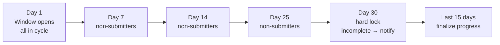

### Event → Recipient Map

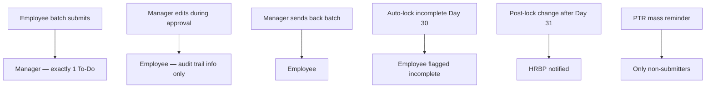

| Trigger Event | Who Receives It | Channel | Who Configures It |
|---|---|---|---|
| Goal window opens (Day 1) | All employees in the cycle | Email · Platform | PTR Admin |
| Day 7 reminder | Employees who have not yet submitted | Email · Platform · ClickUp | PTR Admin |
| Day 14 reminder | Employees who have not yet submitted | Email · Platform · ClickUp | PTR Admin |
| Day 25 reminder | Employees who have not yet submitted | Email · Platform · ClickUp | PTR Admin |
| Employee submits all goals (batch) | Manager — **1 notification only**, not one per goal | Email · Platform · ClickUp (as To-Do item) | Automated |
| Manager edits any goal during approval | Employee — shows exactly what was changed (audit trail) | Platform notification | Automated |
| Manager sends back full submission | Employee | Platform notification | Automated |
| Goals auto-locked with no submission (Day 30) | Employee whose submission is flagged incomplete | Platform notification | Automated |
| Last 15 days of quarter (end-of-quarter prompt) | All employees in the cycle | Connected to reminder cadence | Automated |
| Post-lock change after Day 31 | HRBP (notification only — no approval action required from HRBP for Day 30–31 changes) | Platform notification | Automated |
| Manual mass reminder | Only employees who have not yet submitted (PTR selects template and targets non-submitters) | Email (first) · ClickUp (later) | PTR Admin (manual trigger) |

**Critical rule on batch submission notification:** When an employee submits their entire batch of goals, the manager receives **exactly 1 notification total** — not one notification per goal. This notification must appear as a **To-Do action item** for the manager in the platform and ClickUp.

---

## 6. Edge Cases

### Open Edge-Case Map

```mermaid
mindmap
  root((Edge Cases))
    Goal Creation
      Eligibility decided
      Probation decided
      No submit by Day 30 decided
    Goal Change
      Manager / team move decided
      Org restructure still OPEN
    Approval
      Pending approve after Day 30 decided
      Dispute manager edits OPEN
      Manager leave after approve OPEN
    Check-In
      Leave during check-in window
      Leave entire quarter
      Metric target revised before rating
```

> Items marked OPEN in the sections below are also tracked in [§9 Open Items Register](#9-open-items-register). Decided items are written as rules below.

### Goal Creation Edge Cases

#### Eligibility to Set Goals (Join Date)
- **DECIDED:** An employee is eligible for that quarter’s goal cycle **only if their join date is on or before Day 1 of the quarter**.
- Anyone who joins **after Day 1** (including Day 25) is **not eligible** for goals in that quarter. They enter the goal cycle from the **next** quarter they qualify for.
- Example: join on Day 25 of Q2 → no Q2 goals → start goal-setting in Q3 (if still employed on/before Q3 Day 1).

#### Probation Employees
- **DECIDED:** Probation status **does not matter**.
- If the person joined **on or before Day 1** of the quarter, they **must set goals** under the same framework as everyone else.

#### No Submission by Day 30
- If the employee has not submitted by Day 30, the manager can still **see any incomplete draft** the employee created.
- The submission is **flagged as incomplete** in the system.
- The employee receives a **zero score** for the quarter, which feeds into their annual average.

---

### Goal Change Edge Cases

#### New Manager Mid-Quarter
- **DECIDED:** The employee and their goals **move with the new manager**. Goals are not restarted and are not re-opened for a fresh approval solely because of the manager change.

#### Employee Transfers to a New Team Mid-Quarter
- **DECIDED:** The employee and their goals **shift to the new team and new manager**. Goals follow the person.

#### Goal Becomes Irrelevant (Org Restructure Mid-Quarter)
- ⚠️ **OPEN:** If an org restructure makes a goal irrelevant mid-quarter — who initiates the HRBP change request, and what is the expected turnaround time (SLA) for resolution?

---

### Approval Edge Cases

#### Day 29 Submission, Manager Has Not Approved by Day 30
- **DECIDED:** Do **not** auto-reject. After hard lock, pending submissions stay approvable.
- The **direct line manager can still approve**.
- **HRBP must delegate** approval to the **manager's manager (+1)** so the +1 can also approve.
- See [Stage 4 — Pending Approval After Hard Lock](#pending-approval-after-hard-lock-submitted-not-yet-approved).

#### Employee Disputes Manager Edits
- ⚠️ **OPEN:** If an employee disagrees with changes the manager made during approval — what is the escalation path and who arbitrates the dispute?

#### Manager Goes on Leave After Approving Goals
- ⚠️ **OPEN:** If the manager approved goals but then goes on extended leave before the quarter ends — who conducts the quarterly check-in? Can that substitute manager modify ratings?

---

### Check-In Edge Cases

#### Employee on Leave During the Check-In Window
- ⚠️ **OPEN:** If the employee is on leave during the check-in window (Day 1–15 of the new quarter) — are they excluded from that quarter's check-in, or is their individual window extended?

#### Employee on Leave for the Entire Quarter
- ⚠️ **OPEN:** If the employee is on leave for the **entire quarter** — do they receive a zero score, are they excluded from the quarter's calculation entirely, or is there a leave-adjusted calculation?

#### Metric Target Revised Before Check-In Rating
- ⚠️ **OPEN:** If a strategy change requires a metric target to be revised before the check-in rating is assigned — is this allowed? Who approves the revision, and does it affect the completion percentage shown to the manager?

---

## 7. Data Migration (Goal Data Only)

### Context
The company currently uses **Revolut** as its performance platform. The new platform being built must receive historical goal data from Revolut so that goal history is complete on the new system.

```mermaid
flowchart LR
  R["Revolut<br/>current platform"] --> H2["H2 2025<br/>migrate"]
  R --> Q2["Q2 2026<br/>migrate"]
  R --> Q3["Q3 2026<br/>migrate"]
  R --> Q4["Q4 2026 goals<br/>set in Revolut"]
  Q4 --> DEC{"New platform ready<br/>for Q4 check-in?"}
  DEC -->|Yes OPEN| NP1["Migrate Q4 goals<br/>check-in on new platform"]
  DEC -->|No| NP2["Q4 check-in stays in Revolut<br/>migration scope expands"]
  H2 --> NP["New Performance Platform"]
  Q2 --> NP
  Q3 --> NP
```

### What Needs to Migrate (Goal-Related Data)

| Data | Source | Target | Decision |
|---|---|---|---|
| H2 2025 goal and rating data | Revolut | New platform | ✅ Aligned — migration will happen |
| Q2 2026 goal and rating data | Revolut | New platform | ✅ Aligned — migration will happen |
| Q3 2026 goal and rating data | Revolut | New platform | ✅ Aligned — migration will happen |
| Q4 2026 goals (set in Revolut) | Revolut | New platform | ⚠️ OPEN — see below |

### Q4 2026 Transition
- Q4 2026 goal-setting will be done in **Revolut** (the current platform).
- ⚠️ **OPEN (DAR and Tech to confirm):** Can the new platform be ready in time to run the Q4 2026 check-in? If yes, Q4 goal data must migrate from Revolut to the new platform before the check-in window opens.
- If the new platform is **not ready** for Q4 check-in, Q4 check-in stays in Revolut and migration scope expands accordingly.

### Tech Requirement
- **Tech must scope the migration effort alongside the build.** Migration feasibility and effort must be confirmed by Tech before timelines are set.

### Data Integrity
- ⚠️ **OPEN:** Who validates that migrated Q2 and Q3 2026 data from Revolut matches Revolut records exactly? What is the validation and sign-off process?

---

## 8. Version Roadmap (V1 vs V2)

```mermaid
timeline
  title Feature delivery
  section V1
    OKR read-only reference panel : Day-1 of build
    Email notifications first : ClickUp staged after
  section V2
    OKR click-to-create goal draft : Auto-populate from OKR
    AI goal writing assistant : Structured writing help
    Custom measurement formulas : Formula builder
    Progress dashboard API : External dashboards pull live data
```

| Feature | Version | Notes |
|---|---|---|
| OKR reference panel (read-only) in goal creation screen | **V1** | Available from Day 1 of the build |
| OKR click-to-create goal (auto-populate draft from OKR) | **V2** | Employee clicks an OKR → goal draft auto-populates |
| AI goal writing assistant | **V2** | AI prompts to help employees write better-structured goals |
| Custom measurement formulas | **V2** | Complex formula builder per measurement |
| Progress dashboard API (external dashboard connection) | **V2** | Platform publishes API; external dashboards pull live goal data |
| ClickUp notification integration | **V1 (staged)** | Email notifications first; ClickUp added after |

---

## 9. Open Items Register

### Recently Decided (closed)

| # | Area | Decision |
|---|---|---|
| 4 | Eligibility / late joiner | Eligible **only if join date ≤ Day 1 of the quarter**. Join after Day 1 (e.g. Day 25) → **not eligible** that quarter. |
| 5 | Probation | Probation **does not matter**. Join on/before Day 1 → must set goals like everyone else. |
| 6 + 8 | Manager / team change | Employee **and goals** move to the new manager / new team. |
| 9 | Day 29 submit, no approve by Day 30 | Stay **pending approval**. After hard lock: direct manager can still approve; **HRBP must delegate** approval to **+1**. No auto-reject. |

### Still Open

Every item below is unresolved. Each **must** have an assigned owner and a due date before the build specification is finalized.

```mermaid
flowchart TB
  subgraph Progress["Stage 5"]
    O1["#1 Metric target mid-quarter authority"]
    O2["#2 Progress history: full timeline vs latest"]
  end
  subgraph CheckIn["Stage 6"]
    O3["#3 Self-rating at H1/H2?"]
  end
  subgraph People["Edge — People moves"]
    O7["#7 Org restructure SLA"]
  end
  subgraph Appr["Edge — Approval"]
    O10["#10 Dispute manager edits"]
    O11["#11 Manager leave after approve"]
  end
  subgraph Leave["Edge — Leave / Check-in"]
    O12["#12 Leave during check-in"]
    O13["#13 Leave entire quarter"]
    O14["#14 Retro metric target change"]
  end
  subgraph Mig["Migration"]
    O15["#15 Q4 2026 check-in readiness<br/>DAR · Tech"]
    O16["#16 Migration validation sign-off"]
  end
```

**Build gate:** every remaining OPEN item needs Owner + Due Date before implementation starts.

| # | Stage / Area | Open Question | Owner | Due Date |
|---|---|---|---|---|
| 1 | Stage 5 — Progress Updates | Who can change a metric target mid-quarter? Does it require approval? What happens to progress already logged if the goal is discarded? | — | — |
| 2 | Stage 5 — Progress Updates | Should progress history show the full timeline of every update, or only the latest value? | — | — |
| 3 | Stage 6 — Check-In | Should employee self-rating be introduced at H1/H2 (semi-annual) in addition to or instead of year-end only? | — | — |
| 7 | Edge Cases — Goal Change | Org restructure mid-quarter — who initiates HRBP change request and what is the resolution SLA? | — | — |
| 10 | Edge Cases — Approval | Employee disputes manager edits — what is the escalation path and who arbitrates? | — | — |
| 11 | Edge Cases — Approval | Manager goes on leave after approving goals — who does the check-in and can they modify ratings? | — | — |
| 12 | Edge Cases — Check-In | Employee on leave during check-in window — excluded or individual window extended? | — | — |
| 13 | Edge Cases — Check-In | Employee on leave for entire quarter — zero score, excluded from calculation, or leave-adjusted? | — | — |
| 14 | Edge Cases — Check-In | Metric target revised retroactively before check-in — allowed? Who approves? | — | — |
| 15 | Data Migration | Can Q4 2026 check-in run on the new platform? (DAR and Tech to confirm) | DAR · Tech | — |
| 16 | Data Migration | Who validates migrated Q2/Q3 Revolut data against source records, and what is the sign-off process? | — | — |

---

*Document scope: Goal Management — Stages 1 through 6 only. Annual appraisal, reviews, and post-annual processes are covered in a separate document.*
