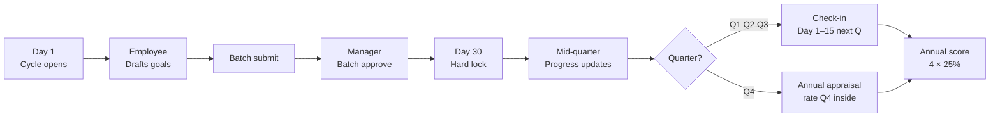
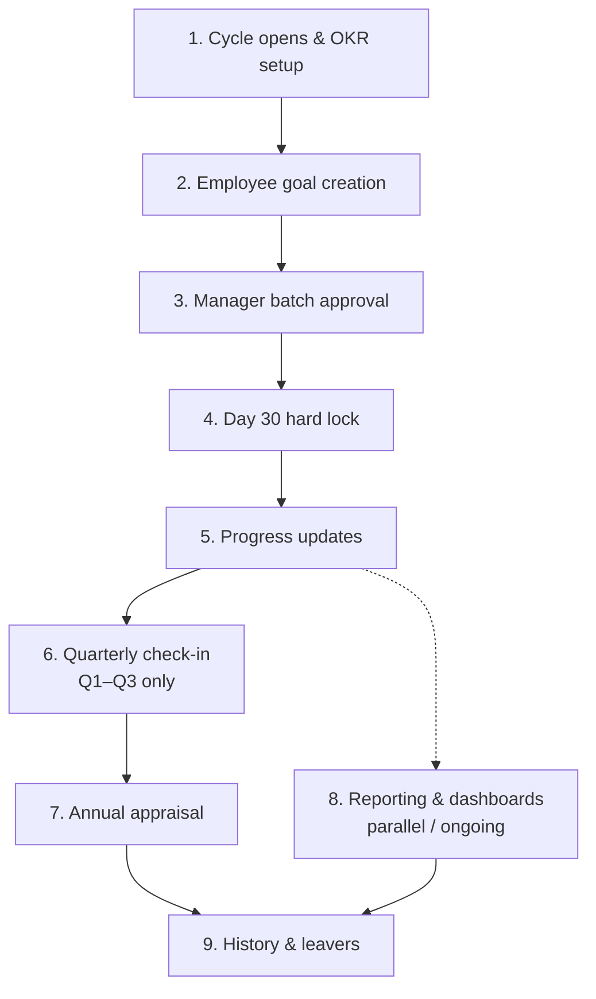
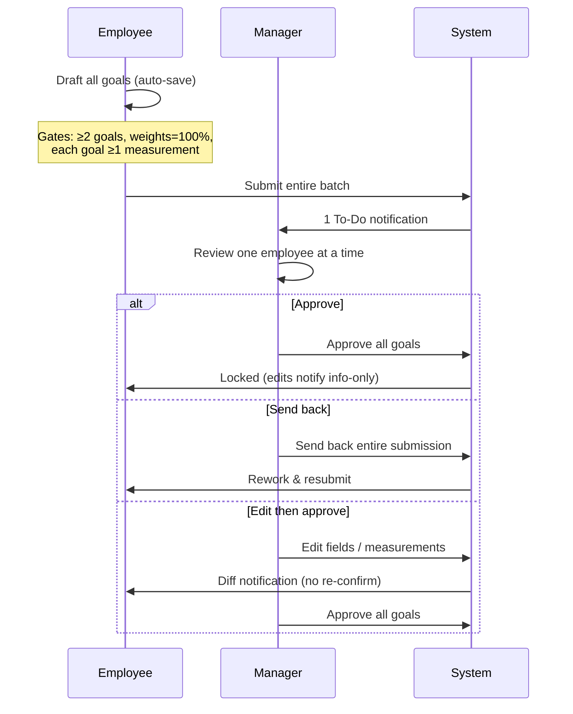
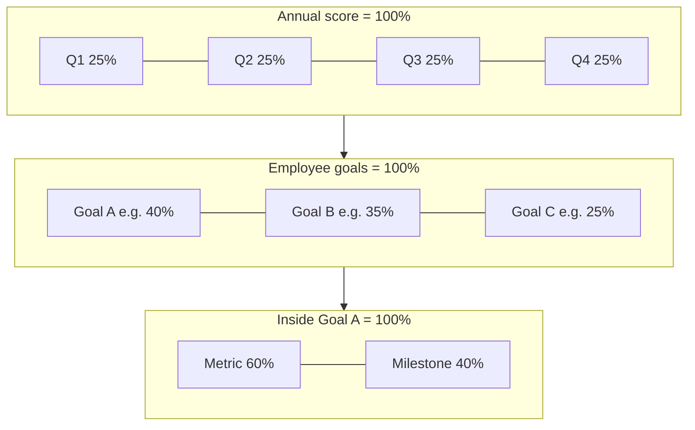
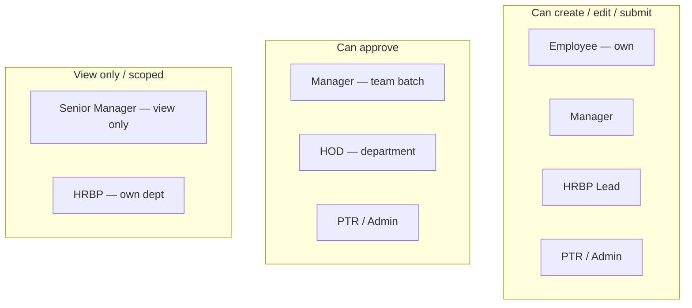
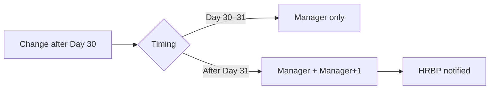
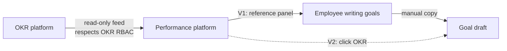

# Goal Management System — Full Specification
> **Source:** FN Group People & Performance — Brainstorming Session 1 (PTR Lead · Internal Use Only)
> **Status:** Decisions captured from live session. Items marked ⚠️ OPEN are unresolved and require an owner + due date.
> **Purpose of this document:** Single source of truth for the Goal Management module. Every decision, rule, permission, flow step, edge case, and open item is written here with zero ambiguity. Nothing requires inference.

---

## Table of Contents
0. [Visual Summary (diagrams)](#0-visual-summary-diagrams)
1. [Roles & Permissions Matrix](#1-roles--permissions-matrix)
2. [Goal Lifecycle — 9 Stages](#2-goal-lifecycle--9-stages)
   - [Stage 1: Cycle Opens & OKR Setup](#stage-1-cycle-opens--okr-setup)
   - [Stage 2: Employee Goal Creation](#stage-2-employee-goal-creation)
   - [Stage 3: Manager Batch Approval](#stage-3-manager-batch-approval)
   - [Stage 4: Day 30 Lock](#stage-4-day-30-lock)
   - [Stage 5: Progress Updates (Mid-Quarter)](#stage-5-progress-updates-mid-quarter)
   - [Stage 6: Quarterly Check-In (Q1, Q2, Q3 Only)](#stage-6-quarterly-check-in-q1-q2-q3-only)
   - [Stage 7: Annual Appraisal Connection](#stage-7-annual-appraisal-connection)
   - [Stage 8: Reporting & Dashboards](#stage-8-reporting--dashboards)
   - [Stage 9: Goal History & Leaver Management](#stage-9-goal-history--leaver-management)
3. [Goal Field Definitions](#3-goal-field-definitions)
4. [Weightage Rules](#4-weightage-rules)
5. [Notification & Reminder Rules](#5-notification--reminder-rules)
6. [Edge Cases](#6-edge-cases)
7. [Data Migration](#7-data-migration)
8. [Version Roadmap (V1 vs V2)](#8-version-roadmap-v1-vs-v2)
9. [Open Items Register](#9-open-items-register)

---

## 0. Visual Summary (diagrams)

> Skim this section first. Detail tables and rules live in sections 1–9 below.

### Mental model

### 9-stage lifecycle

### Approval flow (batch, not per-goal)

### Quarter calendar (concurrent windows allowed)

```mermaid
gantt
  title Typical quarter + next-quarter check-in
  dateFormat  X
  axisFormat  Day %s

  section Goal window
  Goal create / submit / approve     :a1, 1, 30d
  Reminder Day 7                     :milestone, m1, 7, 0d
  Reminder Day 14                    :milestone, m2, 14, 0d
  Reminder Day 25                    :milestone, m3, 25, 0d
  Hard lock                          :milestone, m4, 30, 0d

  section After lock
  Progress updates                   :a2, 31, 60d
  Final reminders last 15 days       :a3, 76, 15d

  section Next quarter
  Check-in Q1–Q3 only Day 1–15       :a4, 91, 15d
  Late log CPM/BI/MKT first 7 days   :a5, 91, 7d
```

### Weightage rules (three levels)

### Roles at a glance

### Post-lock change ladder

### OKR vs Performance (separate systems)

---

## 1. Roles & Permissions Matrix

There are **7 roles** in the system. The table below defines exactly what each role can do with goals.

| Role | Create Goal | Edit Goal | Submit Goal | Approve Goal | View Goals |
|---|---|---|---|---|---|
| **Employee** | ✅ Yes (own goals only) | ✅ Yes (own goals only) | ✅ Yes (own goals only) | ❌ No | ❌ No (cannot view others) |
| **Manager** | ✅ Yes | ✅ Yes (team's goals during approval) | ✅ Yes | ✅ Yes (team's goals) | ❌ No view-only access defined separately |
| **Senior Manager** | ❌ No | ❌ No | ❌ No | ❌ No | ✅ Yes (view only) |
| **HOD (Head of Department)** | ❌ No | ❌ No | ❌ No | ✅ Yes | ✅ Yes |
| **HRBP** (own dept only) | ❌ No | ❌ No | ❌ No | ❌ No | ✅ Yes (own department only) |
| **HRBP Lead** (all depts) | ✅ Yes | ✅ Yes | ✅ Yes | ❌ No | ✅ Yes (all departments) |
| **PTR / Admin** | ✅ Yes | ✅ Yes | ✅ Yes | ✅ Yes | ✅ Yes |

### Role-Specific Clarifications

**Employee**
- Can create, edit, and submit their own goals.
- Cannot approve any goal, including their own.
- Cannot view other employees' goals.
- Cannot edit their own goals mid-quarter after approval without a special multi-approval process (see [Post-Lock Changes](#stage-4-day-30-lock)).

**Manager**
- During the approval stage, can edit: goal description, goal type, goal priority, goal weightage, measurement weightage, and can add or remove measurements.
- Approves goals in batch per employee — cannot approve individual goals within a submission one by one (batch approval is all-or-nothing per employee, with flexibility to revisit — see [Stage 3](#stage-3-manager-batch-approval)).
- Sees their own goals approved by their immediate manager. HOD's goals are approved by SLT (Senior Leadership Team).
- Manager goes through the exact same goal creation and submission process as an employee.

**Senior Manager**
- View only. No create, edit, submit, or approve rights at all.

**HOD**
- Can approve goals within their department.
- View access across the department.
- Own goals are approved by SLT.

**HRBP**
- Can only see goals within their assigned department(s). Cannot see goals outside their department.
- No edit or approval rights.
- Must have access to visualization tools and dashboards to perform their role.

**HRBP Lead**
- Can see all departments.
- Has create, edit, and submit rights but no approval rights.

**PTR / Admin**
- Has all access at all times, with one specific restriction:
  - **Cannot edit their own goals mid-quarter.** This is the same restriction applied to all roles.
- For past-quarter changes by any user: requires approval from both (a) the employee's manager AND (b) the manager's manager (+1) AND (c) HRBP. All three must approve.

---

## 2. Goal Lifecycle — 9 Stages

The goal management process follows a strict sequence of stages within each performance quarter.

---

### Stage 1: Cycle Opens & OKR Setup

**When:** Day 1 of the performance quarter.

#### Goal Window
- The goal submission window **opens on Day 1** and **locks on Day 30**.
- The system must allow PTR Admin to change these dates flexibly (the lock date is not hardcoded — it must be configurable through a simple interface).
- The system must be able to run the current quarter's goal-setting window **at the same time** as the previous quarter's check-in window. Both can be open concurrently.

#### OKR Integration
- The OKR platform and the Performance platform are **two separate systems**. They are not merged.
- Company-level and department-level OKRs are fed into the Performance platform as **read-only context only**.
- Employees can read OKRs inside the platform when writing goals. They cannot edit OKRs from inside the Performance platform.
- The read-only OKR data must respect the **RBAC (Role-Based Access Control) permissions set in the OKR platform** — i.e., a user who cannot see a certain OKR in the OKR platform also cannot see it in the Performance platform.
- Employees can manually copy (carry forward) an OKR into a goal field. This is a manual action by the employee, not an automatic write.
- The RACI from Key Results (KRs) in the OKR platform must be viewable from within the Performance platform.
- **V1:** OKR appears as a read-only reference panel.
- **V2:** A button allows the employee to click an OKR and auto-populate a goal draft from it.

#### Multiple Concurrent Cycles
- The system must support running **multiple performance cycles simultaneously** (e.g., different cycles for different departments, teams, or employee groups).
- Within a single cycle, PTR Admin must be able to **extend the deadline for a specific team, department, or group of people** through a simple interface — without affecting the rest of the org.
- The **frequency of cycles must be configurable** — not fixed to quarterly only.

#### Notifications at Stage 1
- Automated reminders go out at **Day 7, Day 14, and Day 25** of the goal window.
- PTR Admin configures these reminders (timing, cadence, content).
- Reminders are sent via: **Email**, **Platform notification**, and **ClickUp**.
- The notification system must support reminders based on both **specific date** and **specific time of day** (not just date).

---

### Stage 2: Employee Goal Creation

**Who acts:** Employee  
**When:** Day 1 – Day 30 of the quarter

#### OKR Context Panel
- When an employee is creating goals, they see company-level and department-level OKRs in a **read-only reference panel** on the same screen.
- Tagging a goal to an OKR is **not mandatory** in V1.

#### Goal Count Rules
- **Minimum:** 2 goals (system enforces this — employee cannot submit fewer than 2).
- **Recommended:** 3–5 goals.
- **No hard maximum**, but:
  - If the employee submits **fewer than 3 goals**, the system displays a warning: *"Your company requires a minimum of 3 goals. Are you sure you want to submit?"* The employee can still proceed.
  - If the employee submits **more than 5 goals**, the system displays a warning: *"You are submitting more than 5 goals. Are you sure?"* The employee can still proceed.

#### Auto-Save
- All goals are **auto-saved as drafts** continuously while the employee is writing.
- If the employee clicks outside the text field, the draft is **not cancelled or lost**. The content is preserved.
- The employee can close the platform and return across multiple sessions without losing progress.

#### Copy from Last Quarter
- Employees can copy their goals from the previous quarter as a quick-start action.
- Copied goals arrive as **pre-filled draft forms** — the employee sees the filled-in form and must review and edit before submitting.
- Copied goals are **not automatically submitted**. They remain as drafts.

#### Goal Cascade (Manager → Employee)
- A manager can cascade one of their own goals down to a direct report (or further down the chain — e.g., Jayed cascades to Aminul through multiple levels).
- When a manager cascades a goal to an employee (e.g., Angie cascades to Fahim):
  - The cascaded goal appears on **Fahim's dashboard** for him to see and approve.
  - The **"Linked Goals"** field in Fahim's goal form is **auto-filled** with Angie's goal name.
- Linking a goal to a manager's cascaded goal is **optional** — employees are not forced to link.
- The cascade feature must be **powerful enough** to support multi-level cascading across the reporting chain.

#### Goal Fields (Per Goal)
Every goal must contain the following fields. All fields are carried over from Revolut and mapped into the new platform:

| Field | Description | Rules |
|---|---|---|
| **Goal Description** | Free text description of the goal | Required |
| **Goal Type** | Outcome or Output | Required — select one |
| **Process Type** | OKR, BAU (Business As Usual), or PI (Performance Improvement) | Required — select one |
| **Priority** | High, Medium, or Low | Required — select one |
| **Goal Weightage** | Percentage weight of this goal relative to all goals | Required — all goal weightages must sum to exactly 100% before submission |
| **Linked Goals (Cascade)** | Link to a manager's cascaded goal | Optional |
| **Measurements** | At least 1 measurement required per goal (see Measurements section below) | Minimum 1 required |

#### Measurements (Per Goal)
Each goal must have **at least 1 measurement**. A goal can have multiple measurements. Two types of measurements exist and can be mixed within the same goal:

**Type 1 — Milestones (Binary)**
- A checklist of tasks/events.
- Each milestone is either complete (✅) or incomplete (❌). There is no partial state.
- Multiple milestones allowed per goal.

**Type 2 — Metrics (Numeric)**
- Each metric has: a **start value**, a **target value**, and a **current value** (updated by the employee during the quarter).
- Supported comparison directions (carried over from Revolut, keeping only the ones that work):
  - Greater than target (increasing number — e.g., revenue goes up)
  - Less than target (decreasing number — e.g., support tickets go down)
  - Within a range (value must stay between a min and max)
  - *(Remove comparison types from Revolut that did not work in practice)*
- Multiple metrics allowed per goal.
- A goal can have **both milestones and metrics simultaneously** (mixed is allowed).

**Metric Units**
- Units are selected from a **predefined list** (not free text). Options include: `%`, `number`, `days`, `currency`.
- Only **PTR/Admin can add new unit types** to the predefined list.

**Measurement Weightage**
- Each measurement within a goal has its own **weight (%)**.
- All measurement weightages within a single goal must sum to **exactly 100%**.
- The platform shows the employee the **overall % impact** each measurement has on the goal.

**Proof & Comments**
- Each measurement supports: a **proof link** (URL) and a **free text comment**.
- These are available for the employee to attach evidence of progress.

**Custom Formulas**
- Custom measurement formulas are a **V2 feature only**. Not built in V1.
- No third-party integration for measurements (not building integrations).

#### Batch Submission
- The employee drafts **all goals first**, then submits **all goals together in a single action**.
- The **Submit button is locked** until every goal has at least 1 measurement.
- Once submitted, all goals go to the manager for approval as a single batch.

---

### Stage 3: Manager Batch Approval

**Who acts:** Manager  
**When:** After employee submits, before Day 30 lock

#### Approval Screen
- The manager sees a **queue of all their direct reports** who have submitted goals.
- The manager reviews **one employee at a time**, with a "Next" button to move through the queue.

#### Example Flow
1. Fahim (employee) creates and submits goals → goes to Angie (manager).
2. Angie reviews all of Fahim's goals together.
3. If Angie finds an error or issue, she connects with Fahim offline (outside the platform).
4. Fahim makes changes based on the offline discussion.
5. Angie approves **all of Fahim's goals together** in one action.
6. Angie **cannot approve individual goals** within a submission independently — approval is per-employee batch, not per-goal. (This is the default; flexibility to revisit this rule is noted.)

#### What the Manager Can Do During Approval
The manager can perform all of the following actions on an employee's submitted goals:

- ✅ Approve all goals (entire batch)
- ✅ Edit goal description
- ✅ Edit goal type (Outcome/Output)
- ✅ Edit goal priority (High/Medium/Low)
- ✅ Adjust goal weightage (%)
- ✅ Adjust measurement weightage (%)
- ✅ Add new measurements
- ✅ Remove existing measurements
- ✅ Add comments to any goal
- ✅ Send back the entire submission to the employee (cannot send back individual goals — only the whole submission)

#### Employee Notification of Manager Edits
- If the manager edits **anything**, the employee is **automatically notified** of what was changed.
- The notification shows what was changed (audit trail: who changed what, from what value, to what value).
- The employee does **not** need to acknowledge or re-approve the edits. Notification is informational only.
- Manager approval auto-locks the goals — no employee re-confirmation required.

#### Send Back Rules
- The manager can only **send back the entire submission** — not individual goals within a submission.
- Sending back is used when there are major errors or rework needed.

#### Manager Delegation (Absence)
- If a manager is absent, **PTR Admin assigns a delegate** to perform the approval.
- The delegate has the **same rights** as the original manager for approval purposes.
- The **manager record does not change** — only the responsibility is delegated temporarily.
- All delegation actions are **logged in the audit trail**.

#### Manager Reminder Cadence (Two Modes)
**Manual Cadence:**
- PTR can trigger a mass email (or later ClickUp) reminding employees to update goals.
- The mass reminder includes options to:
  - Select a message template.
  - See visibility of how many people have finished vs. not finished.
  - Send only to those who **have not yet submitted** (not to everyone).

**Automated Cadence:**
- When the automated system is built, PTR will configure the rules for when automated reminders fire.

---

### Stage 4: Day 30 Lock

**When:** End of Day 30

#### Hard Lock
- Day 30 is a **hard lock**. After Day 30, no employee can submit new goals and no manager can approve new submissions — without PTR Admin override.

#### Graduated Post-Lock Change Approval
| Timing | Who Must Approve a Change |
|---|---|
| Day 30 – Day 31 | Manager only |
| After Day 31 | Manager + Manager's Manager (+1) — AND HRBP is notified |

- Post-lock change approval rules are a **configurable setting within the cycle setup** (not hardcoded).

#### No Submission by Day 30
- If an employee did not submit goals by Day 30:
  - Their goals are **auto-locked** in whatever state they were in (draft or empty).
  - Their submission is **flagged as incomplete** in the system.
  - Their score for that quarter is automatically **zero (0)**.
  - The zero score **feeds into their annual average**.
  - The manager can still **see the incomplete draft** (if any draft exists).

---

### Stage 5: Progress Updates (Mid-Quarter)

**Who acts:** Employee (primarily), Manager (can adjust)  
**When:** Throughout the quarter after Day 30 lock

#### Employee Progress Updates
- Employees can update their progress **in real time** at any point during the quarter.
- They can also follow a cadence: weekly, monthly, or at quarter-end.
- **Milestone updates:** Employee ticks a milestone as complete (binary toggle).
- **Metric updates:** Employee enters the current value of the metric.

#### Manager Visibility
- The manager can see all progress updates in real time by navigating to an employee's profile.
- The manager does **not** receive a notification or alert every time an employee logs a progress update. Updates are visible on demand, not pushed.

#### Manager Adjustment of Progress
- The manager can **adjust an employee's progress update** if they disagree. For example: if an employee marks a milestone as complete, but the manager disagrees, the manager can reverse it.

#### Target Changes Mid-Quarter
- If a strategy shift causes a metric target to become irrelevant or need revision, the target **can be changed mid-quarter**.
- ⚠️ **OPEN:** Who has the authority to change a metric target mid-quarter (employee only? manager? both?), and does it require approval? What happens to progress already recorded against the original target if the goal is discarded?

#### Blocked Goals
- Employees can mark a goal as "Blocked."
- **No automatic notification** is sent to the manager when a goal is marked blocked.
- *(Decision: The team prefers employees to communicate blockers directly via chat — an automated notification was deemed unnecessary.)*

#### End-of-Quarter Reminders
- In the **last 15 days of the quarter**, the system automatically sends reminders to employees to update their goal status and final result.
- These reminders connect to the existing reminder cadence system.

#### Late Updates (Post-Quarter)
- Employees in certain departments are permitted to log progress updates in the **first 1 week of the new quarter** for the previous quarter's goals.
- This is **required** for the CPM, BI, and MKT departments.

#### Progress History
- ⚠️ **OPEN:** Should the platform show the full timeline of every update made, or only the latest value?
- **V2 option:** The platform publishes an API so employees/managers can connect their own dashboards, and goals update automatically via the API.

---

### Stage 6: Quarterly Check-In (Q1, Q2, Q3 Only)

**Who acts:** Manager  
**When:** Q1, Q2, and Q3 only. Q4 does NOT have a standalone check-in (see Stage 7).

#### Check-In Window
- Opens on **Day 1 of the following quarter**.
- Closes on **Day 15 of the following quarter**.
- PTR Admin can customize these dates if needed.

#### Check-In Format
- Follows the existing Revolut check-in format. The team is familiar with this structure and it is retained.

#### What the Manager Sees
- For each of the employee's goals: the **goal completion % per goal**.
- An overall **weighted completion %** calculated by the system (based on goal weightages and measurement weightages).
- The system displays the percentage — the system does **not** recommend a rating. The manager makes the rating call independently.

#### Rating Scale
- The manager rates each quarter on a **5-tier scale**.
- Each quarter is rated **independently** of other quarters.

#### Comment Box
- There is a **free text comment box** per check-in for the manager to add narrative context.

#### Employee Self-Rating
- Employees do **not** self-rate at the quarterly check-in.
- Employee self-rating happens **only at the annual appraisal** (year-end).
- ⚠️ **OPEN:** Should self-rating happen at H1 and H2 (semi-annual) instead of just at year-end? To be decided.

#### Rating Visibility to Employee
- The quarterly rating is **not automatically visible** to the employee when it is submitted.
- The rating becomes visible to the employee **only when the manager or PTR actively releases it**.

#### Stage Independence
- Each check-in runs **independently per population**.
- A delay by a senior leader in completing their check-in does **not block** the rest of the organization from completing theirs.

#### Quarter Weightage for Annual Score
- All four quarters are weighted **equally** in the annual score calculation: each quarter = 25%.

---

### Stage 7: Annual Appraisal Connection

**Who acts:** System (auto-populates Q1–Q3), Manager (rates Q4 as first step)  
**When:** Year-end annual appraisal

#### Q1–Q3 Ratings
- Q1, Q2, and Q3 ratings are **automatically populated** into the annual appraisal form.
- These ratings are **read-only** inside the annual appraisal — they cannot be changed at this stage.

#### Q4 Rating
- **There is no standalone Q4 check-in.**
- The Q4 rating is completed by the manager as the **first step inside the annual appraisal process**.
- The manager rates Q4 performance inside the annual appraisal form.

#### Quarter Weightage
- Equal weight: Q1 = 25%, Q2 = 25%, Q3 = 25%, Q4 = 25%.

#### Missing Quarter (Zero Score)
- ⚠️ **OPEN:** If an employee has a zero score for a quarter (e.g., they did not submit goals), does that zero feed into the annual average (penalizing them), or is that quarter excluded from the calculation entirely?

#### Mid-Year Joiner
- ⚠️ **OPEN:** If an employee joins in Q2, their annual score only covers Q2, Q3, and Q4. How is the annual score calculated — equally weighted across the 3 available quarters, or prorated?

#### Annual Appraisal Design
- ⚠️ **OPEN:** Full annual appraisal form design, self-review structure, calibration process, and rating communication workflow — to be defined in a future session.

---

### Stage 8: Reporting & Dashboards

#### Real-Time Dashboard
- The platform connects to the existing **FN Performance Dashboard**.
- Tracks goal submission compliance and approval compliance in real time.

#### Export
- ⚠️ **OPEN:** Dashboard data must be exportable. Format (CSV, PDF, Excel?) and access level (who can export?) to be confirmed with Tech.

#### Manager Dashboard
- The manager sees for their team:
  - Goal progress per employee
  - Submission status (submitted / not submitted)
  - Check-in completion status
  - All updated in real time

#### Senior Manager Dashboard
- The senior manager sees:
  - Everything the manager dashboard shows for their direct teams.
  - A cascaded view: for any direct report who is also a manager, they can see that manager's team data too (one level deeper).

#### HOD Dashboard
- The HOD sees department-level aggregates:
  - Goal progress across all teams in the department
  - Submission compliance
  - Check-in completion

#### PTR Dashboard
- The PTR sees org-wide data:
  - Who has submitted (by name/team/dept)
  - Who is pending
  - Who is overdue
  - Goal quality indicators

#### HRBP Dashboard
- HRBP must have access to **visualization tools and dashboards** specific to their department population.
- This is required for HRBPs to perform their job functions.

---

### Stage 9: Goal History & Leaver Management

#### Goal History Retention
- All goal records and all quarterly/annual ratings are retained **permanently** in the employee's profile.
- There is no deletion or archiving of historical goal data.

#### Leaver Profiles
- When an employee leaves the company:
  - Their rating history is **retained in the system**.
  - Their profile is set to **inactive** (not deleted).
  - Their historical data remains accessible.
- ⚠️ **OPEN:** Who can see a leaver's historical data? Only PTR, or also the employee's previous managers?

---

## 3. Goal Field Definitions

| Field | Allowed Values | Mandatory? | Who Can Edit After Submission |
|---|---|---|---|
| Goal Description | Free text | ✅ Yes | Manager (during approval), PTR Admin (always) |
| Goal Type | `Outcome` or `Output` | ✅ Yes | Manager (during approval), PTR Admin (always) |
| Process Type | `OKR`, `BAU`, `PI` | ✅ Yes | Manager (during approval), PTR Admin (always) |
| Priority | `High`, `Medium`, `Low` | ✅ Yes | Manager (during approval), PTR Admin (always) |
| Goal Weightage | % (integer or decimal, must sum to 100% with all other goals) | ✅ Yes | Manager (during approval), PTR Admin (always) |
| Linked Goal (Cascade) | Reference to manager's goal | ❌ Optional | Manager (during approval), PTR Admin (always) |
| Measurements | Min 1 required (milestones and/or metrics) | ✅ Yes (min 1) | Manager (add/remove during approval), Employee (update values mid-quarter), PTR Admin (always) |
| Measurement Weightage | % per measurement (must sum to 100% within the goal) | ✅ Yes | Manager (during approval), PTR Admin (always) |
| Metric Unit | Selected from predefined list: `%`, `number`, `days`, `currency` | ✅ Yes (for metric type measurements) | PTR Admin only (to add new unit types to the list) |
| Proof Link | URL | ❌ Optional | Employee (mid-quarter), PTR Admin (always) |
| Comments | Free text | ❌ Optional | Employee (mid-quarter), Manager (during approval and check-in), PTR Admin (always) |

---

## 4. Weightage Rules

### Rule 1 — Goal Weightage (across all goals)
- Each goal has a weightage percentage.
- The sum of all goal weightages **must equal exactly 100%** before the employee can submit.
- The submit button is **locked** until this condition is met.

### Rule 2 — Measurement Weightage (within each goal)
- Each measurement within a goal has a weightage percentage.
- The sum of all measurement weightages **within a single goal** must equal exactly 100%.
- This is enforced per goal — not across goals.

### Rule 3 — Quarter Weightage (for annual score)
- Q1 = 25%, Q2 = 25%, Q3 = 25%, Q4 = 25%.
- Equal weight. Not configurable per the current decision.

---

## 5. Notification & Reminder Rules

| Trigger | Recipients | Channel | Configured By |
|---|---|---|---|
| Goal window opens (Day 1) | All employees in cycle | Email, Platform | PTR Admin |
| Day 7 reminder | Employees who haven't submitted | Email, Platform, ClickUp | PTR Admin |
| Day 14 reminder | Employees who haven't submitted | Email, Platform, ClickUp | PTR Admin |
| Day 25 reminder | Employees who haven't submitted | Email, Platform, ClickUp | PTR Admin |
| Employee submits all goals (batch) | Manager (1 notification only — not per goal) | Email, Platform, ClickUp (To-Do) | Automated |
| Manager edits any goal during approval | Employee (shows what was changed) | Platform notification | Automated |
| Manager sends back submission | Employee | Platform notification | Automated |
| Goals locked (Day 30) | Any employee with incomplete submission (flagged) | Platform notification | Automated |
| Last 15 days of quarter | All employees (update goals reminder) | Connected to reminder cadence | Automated |
| Post-lock change (after Day 31) | HRBP | Platform notification | Automated |
| Manual mass reminder by PTR | Selected employees (only those who haven't submitted) | Email (first), ClickUp (later) | PTR Admin (manual trigger) |

**Key rule:** When an employee submits their entire batch of goals, the manager receives **exactly 1 notification** — not one notification per goal. This notification should appear as a **To-Do item** for the manager.

---

## 6. Edge Cases

### Goal Creation Edge Cases

#### Late Joiner
- **Current rule (from Revolut):** Employees who join on or before the **first day of the quarter** are included in that quarter's goal cycle.
- ⚠️ **OPEN:** What happens to an employee who joins on Day 25 of the goal window? Are they included in this quarter or auto-enrolled in the next quarter? This also raises the question of how probation staff goals are handled (probation employees may have different onboarding timelines).

#### No Submission by Day 30
- If an employee doesn't submit, their draft (if any) remains visible to the manager.
- The submission is flagged as incomplete.
- The employee receives a zero score for the quarter (feeds into annual average).

#### Probation Employees
- ⚠️ **OPEN:** Do probation employees follow the same goal cycle as confirmed employees, or do they have a separate probation performance framework?

---

### Goal Change Edge Cases

#### Manager Change Mid-Quarter
- ⚠️ **OPEN:** If an employee's manager changes mid-quarter, does the new manager inherit the already-approved goals as-is? Or can the new manager reopen and re-approve the goals?

#### Goal Becomes Irrelevant (Org Restructure)
- ⚠️ **OPEN:** If an org restructure mid-quarter makes a goal irrelevant, who initiates the HRBP change request, and what is the SLA for resolution?

#### Employee Transfer Mid-Quarter
- ⚠️ **OPEN:** If an employee transfers to a new team mid-quarter, do their goals transfer to the new manager? Do they stay with the old manager? Or do they restart goal-setting with the new team?

---

### Approval Edge Cases

#### Day 29 Submission, Manager Hasn't Approved by Day 30
- ⚠️ **OPEN:** If an employee submits on Day 29 and the manager has not approved by Day 30 — what happens? Does the system auto-lock it as "submitted" (and the manager approves after Day 30 under the post-lock process)? Or is it auto-rejected?

#### Employee Disputes Manager Edits
- ⚠️ **OPEN:** If an employee disagrees with changes the manager made during approval — what is the escalation path? Who arbitrates the dispute?

#### Manager Goes on Leave After Approval
- ⚠️ **OPEN:** If the manager approved the goals but then goes on extended leave before the quarter ends — who conducts the quarterly check-in? Can that substitute manager modify ratings?

---

### Check-In Edge Cases

#### Employee on Leave During Check-In Window
- ⚠️ **OPEN:** If the employee is on leave during the check-in window (Day 1–15 of the new quarter) — are they excluded from that quarter's check-in, or is their individual window extended?

#### Employee on Leave for the Full Quarter
- ⚠️ **OPEN:** If the employee is on leave for the **entire quarter** — do they receive a zero score, are they excluded from that quarter's calculation, or is there a leave-adjusted calculation?

#### Metric Target Revised Retroactively Before Check-In
- ⚠️ **OPEN:** If the strategy changed and the metric target needs to be revised — can this be done retroactively before the check-in rating is assigned? Who approves this revision?

---

## 7. Data Migration

### Context
The company currently uses **Revolut** as its performance platform. A new platform is being built. Historical data must migrate to ensure the January 2027 annual appraisal has complete data.

### What Needs to Migrate
| Data | Source | Target | Status |
|---|---|---|---|
| H2 2025 goal and rating data | Revolut | New platform | ✅ Aligned — migration will happen |
| Q2 2026 goal and rating data | Revolut | New platform | ✅ Aligned — migration will happen |
| Q3 2026 goal and rating data | Revolut | New platform | ✅ Aligned — migration will happen |
| Q4 2026 goals (set in Revolut) | Revolut | New platform | ⚠️ OPEN — see below |

### Q4 2026 Transition Decision
- Q4 2026 goal-setting will be done in **Revolut** (the old platform).
- ⚠️ **OPEN (DAR and Tech to confirm):** Can the Q4 2026 check-in and the annual appraisal be done on the **new platform** instead of Revolut? If yes, Q4 data must migrate from Revolut to the new platform in time for the check-in window.

### Migration Timeline
- The new platform needs to be ready for the **Q4 check-in** (earliest possible migration point).
- If the new platform is not ready for Q4 check-in, the Q4 check-in stays in Revolut and migration scope expands.
- **Tech must scope migration effort alongside the build.** Migration feasibility and effort must be confirmed by Tech.

### Data Integrity
- ⚠️ **OPEN:** Who validates that migrated Q2 and Q3 2026 data from Revolut matches Revolut records exactly? What is the validation process?

### Self-Evaluation and Annual Timing
- The team must decide on the exact timing for: **self-evaluation**, **Q4 rating**, and **annual check-in** — i.e., which happens first, second, and third, and on what dates.

---

## 8. Version Roadmap (V1 vs V2)

| Feature | Version | Notes |
|---|---|---|
| OKR reference panel (read-only) | V1 | Available on Day 1 of build |
| OKR click-to-create goal button | V2 | Employee clicks OKR → goal draft auto-populated |
| AI goal writing assistant | V2 | AI prompts to help employees write better goals |
| Custom measurement formulas | V2 | Complex formula builder for measurements |
| Progress dashboard API (external connect) | V2 | Platform publishes API; external dashboards pull live data |
| ClickUp notification integration | V1 (email first, ClickUp later) | Email notifications first; ClickUp added after |

---

## 9. Open Items Register

Every item below is unresolved. Each **must** have an assigned owner and a due date before the next session.

| # | Module | Open Item | Owner | Due Date |
|---|---|---|---|---|
| 1 | Permissions | Who can see a leaver's historical data — PTR only or also previous managers? | — | — |
| 2 | Stage 1 | Exact configuration of the Day 30–31 graduated post-lock approval in cycle settings — who builds the UI for this? | — | — |
| 3 | Stage 5 | Who can change a metric target mid-quarter? Does it require approval? What happens to progress already logged against a discarded goal? | — | — |
| 4 | Stage 5 | Should the progress history show the full timeline of every update or only the latest value? | — | — |
| 5 | Stage 6 | Should employee self-rating happen at H1 and H2 (semi-annual) in addition to or instead of year-end only? | — | — |
| 6 | Stage 7 | If a quarter has a zero score (no submission) — does it count as zero in the annual average, or is it excluded? | — | — |
| 7 | Stage 7 | Mid-year joiner annual score calculation — equal weight across available quarters or prorated? | — | — |
| 8 | Stage 7 | Full annual appraisal form design, self-review structure, calibration, and rating communication — design session needed | — | — |
| 9 | Stage 8 | Dashboard export format (CSV/PDF/Excel?) and who has export access — confirm with Tech | — | — |
| 10 | Edge Cases | Late joiner on Day 25 — enrolled this quarter or next? | — | — |
| 11 | Edge Cases | Probation employees — same cycle as confirmed employees or separate framework? | — | — |
| 12 | Edge Cases | New manager mid-quarter — inherits approved goals as-is or can reopen? | — | — |
| 13 | Edge Cases | Org restructure mid-quarter — who initiates HRBP change request and what is the resolution SLA? | — | — |
| 14 | Edge Cases | Employee transfer mid-quarter — goals follow employee (new manager) or stay with old manager or restart? | — | — |
| 15 | Edge Cases | Day 29 submission, manager hasn't approved by Day 30 — auto-lock as submitted or auto-rejected? | — | — |
| 16 | Edge Cases | Employee disputes manager edits — escalation path and arbitration process? | — | — |
| 17 | Edge Cases | Manager goes on leave after goal approval — who does check-in, can they modify ratings? | — | — |
| 18 | Edge Cases | Employee on leave during check-in window — excluded or individual window extended? | — | — |
| 19 | Edge Cases | Employee on leave for entire quarter — zero score, excluded, or leave-adjusted? | — | — |
| 20 | Edge Cases | Metric target revised retroactively before check-in — is this allowed, and who approves? | — | — |
| 21 | Data Migration | Can Q4 2026 check-in be done on the new platform? (DAR and Tech to confirm) | DAR, Tech | — |
| 22 | Data Migration | Who validates migrated Q2/Q3 Revolut data matches source records? | — | — |
| 23 | Data Migration | Exact timing for self-evaluation, Q4 rating, and annual check-in sequence | — | — |

---

*Document last updated based on Session 1 decisions. All items marked ⚠️ OPEN must be resolved before build specification is finalized.*